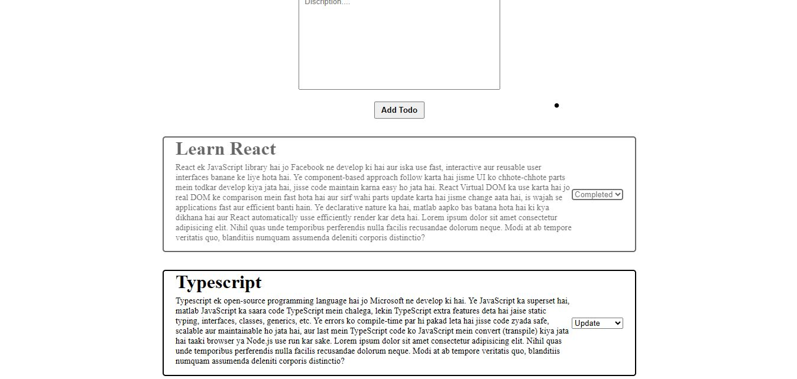

# 📝 Todo App (TypeScript + React)

A simple and responsive **Todo App** built with **React + TypeScript**.  
This app allows users to add, update, and delete todos with a clean UI and modern state management.

---

## 🚀 Features
- ➕ Add new todos
- ✏️ Update existing todos
- 🗑️ Delete todos
- ✅ Mark todos as completed
- 🔍 Search functionality (optional, if you added)
- ⚡ Built with TypeScript for type safety

---

## 🛠️ Tech Stack
- **React** (Frontend framework)
- **TypeScript** (Static typing)
- **Vite / CRA** (Bundler, depends on what you used)
- **CSS / Tailwind** (Styling)

---

## 📂 Project Setup

Clone the repository:
```bash
git clone git remote add origin https://github.com/Sachin-Shah-25/Todo-.git
cd todo-app

Install dependencies:

yarn install


Run the development server:

yarn dev


Build for production:
yarn build


## 📸 Screenshots  

### Home Page  
  

### Add Todo  
  

# 📝 Test Todo App
This is a test readme file.
git checkout main
git pull
# Open README.md in editor to verify content
git add README.md
git commit -m "Ensure README content"
git push origin main